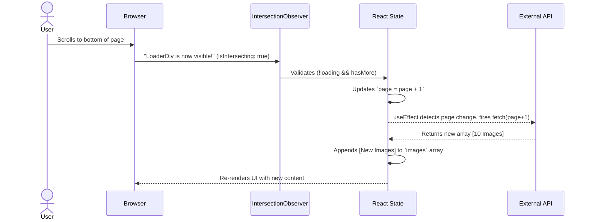
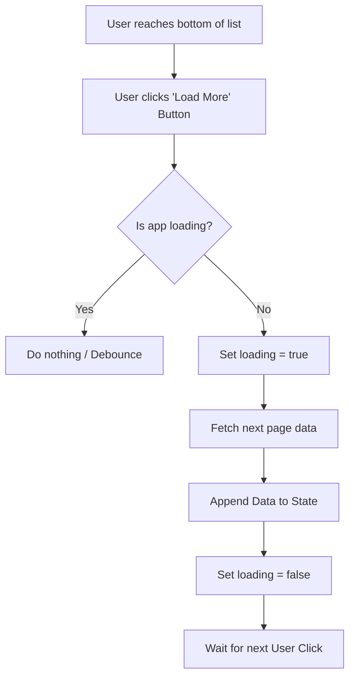

# 📸 React Infinite Scroll Image Gallery

A performant and modern image gallery built with React, demonstrating **Infinite Scrolling** and **Lazy Loading**. It uses the native `IntersectionObserver` API to seamlessly load more images as the user scrolls to the bottom of the page, ensuring optimal performance and a smooth user experience.

---

## 🔍 The Analogy: The "Security Camera" (Intersection Observer)

Think of the **Intersection Observer** as a **Security Camera** 🎥.
- **The Camera (Observer):** Watches a specific point in your application.
- **The Target (Loader Div):** The designated "tripwire" area at the bottom of the image list.
- **The Callback (Action):** When the target enters the camera's view (is intersecting), the system triggers an action (fetching the next page of images).
- **Cleanup (Unobserve):** Turning the camera off when the target is removed or we stop caring about it, preventing performance leaks.

---

## 💻 The Code (`App.jsx`)

Here is the complete code for the image gallery. Pay attention to the commented lines explaining the core logic!

```jsx
import { useEffect, useRef, useState } from "react";

export default function App() {
  // 1️⃣ State Management
  const [images, setImages] = useState([]); // Stores the accumulated list of images
  const [page, setPage] = useState(1);      // Tracks the current page number for the API
  const [loading, setLoading] = useState(false); // Prevents multiple simultaneous API calls
  const [hasMore, setHasMore] = useState(true);  // Flags if there's more data to fetch

  // 2️⃣ The Target Reference
  // This ref is attached to the div at the very bottom of the page.
  const loaderRef = useRef(null);

  // 3️⃣ Fetch Images Logic
  const fetchImages = async () => {
    // If a request is already running or no more data exists, abort to prevent extra calls
    if (loading || !hasMore) return;

    setLoading(true);
    try {
      // Fetching 10 images per page using Picsum API
      const res = await fetch(
        `https://picsum.photos/v2/list?page=${page}&limit=10`
      );
      const data = await res.json();

      if (data.length === 0) {
        // If the API returns an empty array, we've reached the end of the content
        setHasMore(false);
      } else {
        // Use functional state update to safely append new images to the existing list
        // Prevents stale state bugs when rapidly firing requests
        setImages((prevImages) => [...prevImages, ...data]);
      }
    } catch (error) {
      console.error("Error fetching images:", error);
    } finally {
      // Ensure loading state is turned off regardless of success or failure
      setLoading(false);
    }
  };

  // 4️⃣ Trigger API Call
  // This runs initially and every time the 'page' state increments
  useEffect(() => {
    fetchImages();
  }, [page]);

  // 5️⃣ Intersection Observer Logic
  useEffect(() => {
    // Set up the "Camera" (Observer)
    const observer = new IntersectionObserver((entries) => {
      // If the target is visible on screen AND we aren't currently loading AND there's more data...
      if(entries[0].isIntersecting && !loading && hasMore){
        // Increment the page number. This triggers the fetchImages hook above!
        setPage((prevPage) => prevPage + 1);
      }
    });

    // The element we want to watch
    const loaderDiv = loaderRef.current;

    // Turn on the camera for our loaderDiv
    if (loaderDiv) {
      observer.observe(loaderDiv);
    }

    // 🔥 Cleanup Function
    // This runs when components unmount or before the effect runs again.
    // Crucial for preventing memory leaks!
    return () => {
      if (loaderDiv) {
        observer.unobserve(loaderDiv);
      }
    };
  }, [loading, hasMore]); // Must re-evaluate if loading or hasMore changes to avoid stale scope

  return (
    <div style={{ padding: "20px" }}>
      <h2>Infinite Scroll Images 🚀</h2>

      {/* 6️⃣ Render the Image Grid */}
      <div
        style={{
          display: "grid",
          gridTemplateColumns: "repeat(auto-fill, minmax(200px, 1fr))",
          gap: "10px",
        }}
      >
        {images.map((img) => (
          
        ))}
      </div>

      {/* 7️⃣ The "Tripwire" Loader Element */}
      {/* This is the reference element our observer is watching! */}
      <div ref={loaderRef} style={{ textAlign: "center", padding: "20px" }}>
        {loading && <p>Loading...</p>}
        {!hasMore && <p>No more images 🚫</p>}
      </div>
    </div>
  );
}
```

---

## 🗺️ System Diagrams

### 1. Infinite Scroll Flow

This sequence shows how scrolling triggers data fetching seamlessly.



### 2. State Update Progression

A visualization of how the internal array and page number progress with each cycle.

```mermaid
stateDiagram-v2
    state "Page 1: Initial Load" as P1 {
        Page: 1
        Images: [Img 1 ... Img 10]
    }
    state "Page 2: First Scroll" as P2 {
        Page: 2
        Images: [Img 1 ... Img 10] + [Img 11 ... Img 20]
    }
    state "Page N: End of Content" as PN {
        Page: N
        hasMore: false
        Images: [...All Images]
    }

    [*] --> P1: App Mounts
    P1 --> P2: Observer intersects (Scroll down)
    P2 --> PN: API returns empty []
    PN --> [*]: Stop observing
```

### 3. Click-to-Load Alternative

If we didn't use an `IntersectionObserver`, we'd typically use a "Load More" button. Here's how that flow would look:


*(The Infinite Scroll eliminates the manual "Click" step, automating the process based on screen visibility).*

---

## 📝 Summary & Key Takeaways

1. **Reactive State Pattern:** The system runs on a reactive `useEffect` that listens specifically to the `page` number. We don't fetch data directly in the observer; we increment the page number, and the app reacts to that change.
2. **Safe Array Updating:** Because API calls are asynchronous, we use the functional update pattern `setImages(prev => [...prev, ...data])` to ensure we append to the most up-to-date version of our state.
3. **The `loading` Lock:** Notice `!loading` in both the fetch function and the observer trigger. This prevents spamming the API with duplicate requests if the user scrolls vigorously.
4. **Vital Cleanup:** `observer.unobserve()` is required in the `useEffect` cleanup return. If the component ever unmounts or re-renders unexpectedly without this, memory leaks and phantom duplicate observers will ruin performance.
5. **Double-Performance Boost:** Combined with the `` native attribute, this app optimizes both **network requests** (by paginating) and **browser rendering** (by deferring painting of off-screen images).
